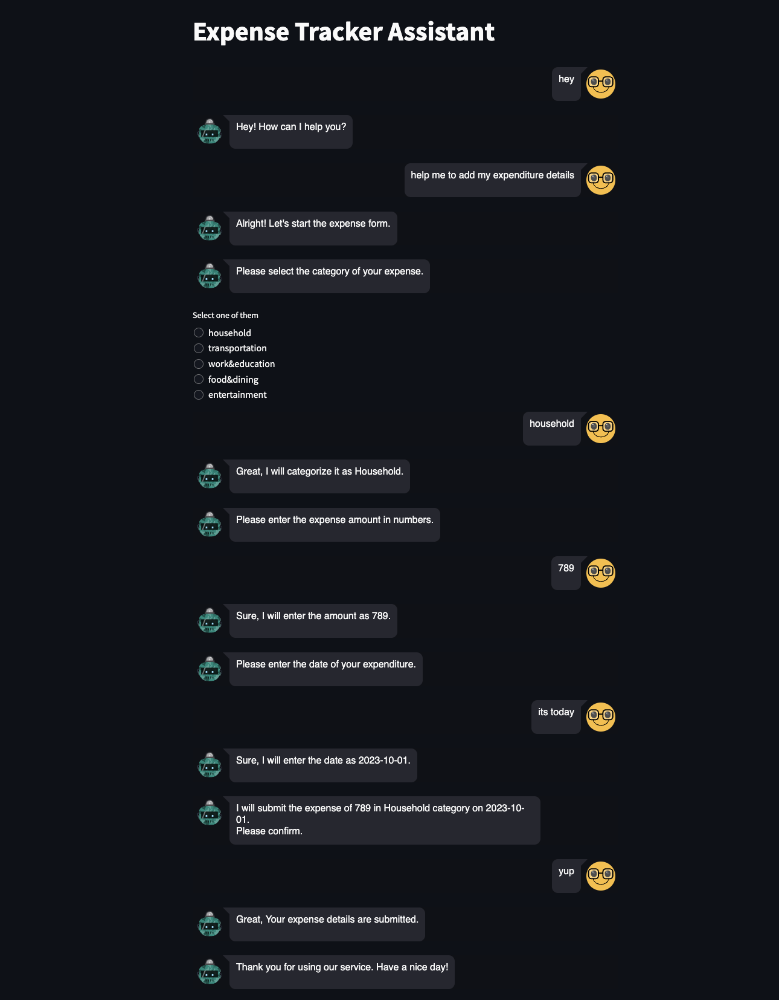
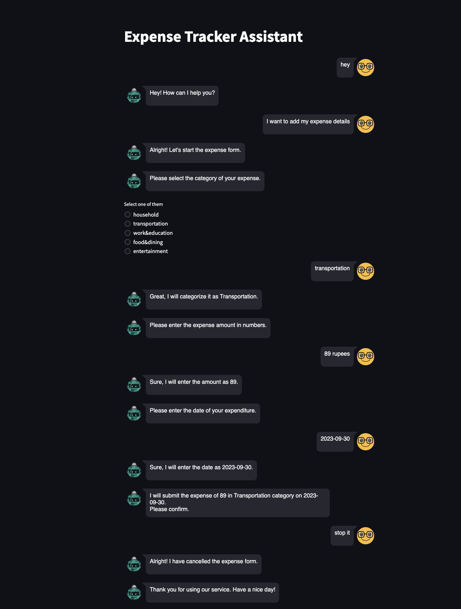

# Expense-Tracker-Chatbot

 Expense-Tracker-Chatbot is an innovative project that combines the power of natural language processing and data visualization enabling users to track their expenses. It is built using the RASA framework and hosted on Streamlit and uses PostgreSQL Database to store and manage expense data. 

## Tech Stack :
   1. Python 
   2. Rasa 
   3. Streamlit for hosting 

## Usage
To enter a new expense: 

1. Initiate the expense entry by informing the chatbot. 
2. Provide the spending category, amount, and date when prompted. 
3. Confirm the details once all information is provided. 
4. If confirmed, the expense will be submitted, and a confirmation message will be displayed. 
5. To cancel the expense entry, notify the chatbot at any step during the process. 

## Screenshot Chatbot

## Output 

